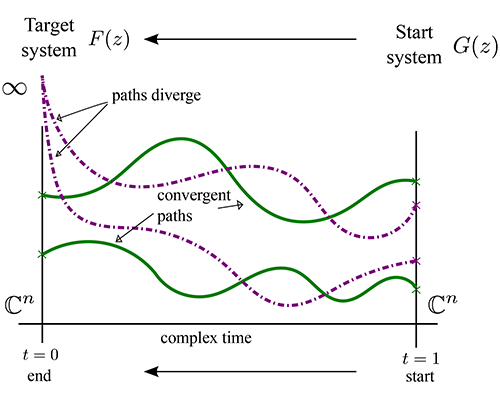

 \mainpage Bertini Real

# Summary

 Bertini Real is a real-solution-set decomposition method implemented using [Bertini](http://www3.nd.edu/~sommese/bertini) as its main computational engine.

The main algorithm used in Bertini Real is homotopy continuation:

In this method, we continue solutions from one system to another, through a homotopy.

Bertini Real uses as its input a text file, and the user passes the text file through two programs.  First, the user performs a numerical irreducible decomposition using Bertini's tracktype:1, producing a file called 'witness_data'.  Second, the user calls bertini_real on the same input file, with witness_data in place, and produces a real decomposition.  This, of course, depends on the existence of a complex component of decomposable dimension -- at this time, dimensions 1 and 2.

Bertini Real produces a folder of text files as output.  Which files are produced depends on whether a curve or surface was decomposed.  Common files are:

* the computed vertices,
* decomposition commonalities,
* witness set used to decompose,
* a copy of the input file,
* a copy of the witness data file.

Surfaces additionally produce:

* surface file, giving summary information,
* faces file, connecting computed vertices into 2-cells,
* all sub-decompositions, which are curves -- critical curves, singular curves, the sphere intersection curve, and all mid- and crit-slice curves.

Curves produce:

* curve file, giving summary information,
* edges file, connecting computed vertices into 1-cells.

