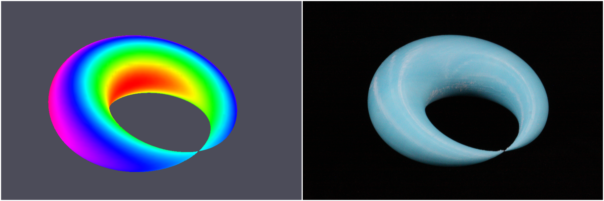
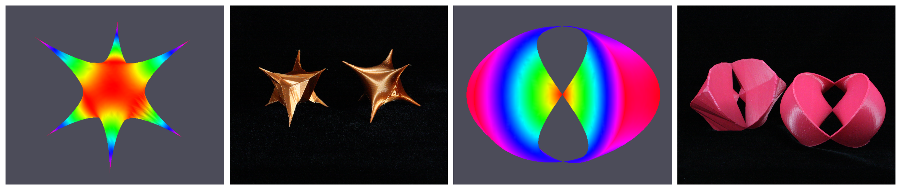

.. Test documentation master file, created by
   sphinx-quickstart on Mon Feb 25 16:34:57 2019.
   You can adapt this file completely to your liking, but it should at least
   contain the root `toctree` directive.

Welcome to Bertini_real's Python visualization documentation!
**************************************************************

This is the documentation for `Bertini_Real <https://github.com/ofloveandhate/bertini_real>`_ python implementation for surface visualization. Follow the tutorials below to learn how to plot surfaces in Glumpy 🌈 & export 3D stereolithography (STL) for 3d printing 🧱 !

Introduction
============

.. toctree::
   :maxdepth: 1
   :caption: Bertini_real
   
   tutorials/bertini_real
   tutorials/matplotlib

Tutorials ✏️
============

.. toctree::
   :maxdepth: 1
   :caption: Contents:
   
   tutorials/glumpy
   tutorials/tmesh
   tutorials/anaglypy

Details 📝
================

.. toctree::
   :maxdepth: 14
   :caption: Contents:

   anaglypy
   curve
   data
   decomposition
   dehomogenize
   parse
   plot
   tmesh
   surface
   util
   vertex
   vertextype
   glumpy

Implementation notes
======================

.. toctree::
   :maxdepth: 1
   :caption: Contents:

   todo

Indices and tables 📋
==========================

* :ref:`genindex`
* :ref:`modindex`
* :ref:`search`

Contact 📧
=================

If you have any questions, feel free to email `Silviana <mailto:silviana.amethyst@gmail.com>`_!

