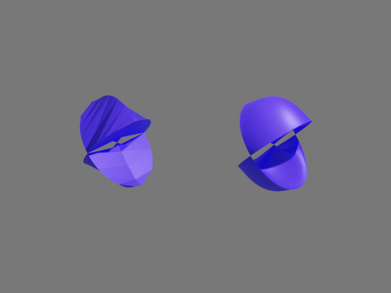
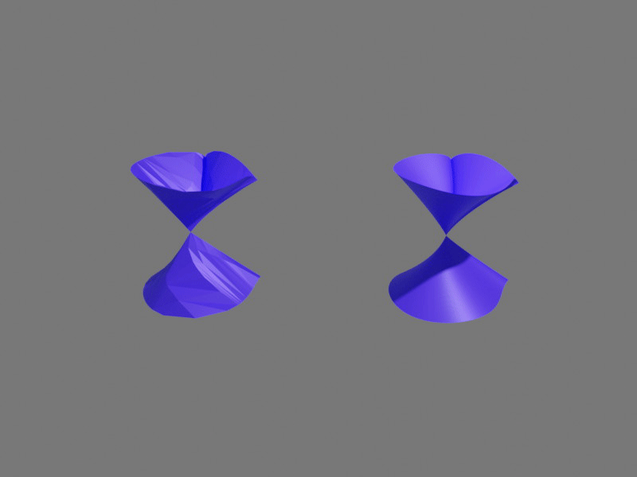

Introduction to Anaglypy with bertini_real
===========================================

The Anaglypy class in bertini_real allows user to render 3d anaglyph movies of algebraic surfaces using Blender/Python API. 

Python Scripting
*****************

After decomposing a surface, you can either run the rendering process manually from command-line or automate it through a shell script, ``anaglypy.sh`` (can be found in bertini_real's python ``anaglypy`` folder) to export 3d stereoscopic movies. Please make sure you are using Python 3.7 (matches with the python version of Blender), have already installed Blender 2.8 and added it to the environmental path.

We are using a surface **"Crixxi"** in this example.

Using Shell Scripting
**********************

First, create a folder (e.g., ``data/`` ) containing all subfolders of surfaces that you have already decomposed by bertini_real.

Copy ``anaglypy.py`` and ``anaglypy.sh`` located in bertini_real's ``anaglypy`` python folder to the ``data/`` folder you just created.

Remember to change permission of the shell script:

::

    $ chmod 755 anaglypy.sh

You will need **four** files to automate the video rendering process:

1. anaglypy.py (A Blender Python API script)
2. anaglypy.sh (An automation video rendering shell script)
3. anaglypy.json (A JSON file specifying object and video settings)
4. surfaces.txt (A texfile containing the names of surfaces)

Example: ``surfaces.txt``
++++++++++++++++++++++++++
::

    crixxi
    daisy

Explanation of ``anaglypy.json``
+++++++++++++++++++++++++++++++++
``anaglyph`` can be either 0 (Non-Anaglyph 3D Effect) ot 1 (Anaglyph 3D Effect)
``raw_smooth`` can be "Raw", "Smooth" or "Both"
``animation`` can be "Rotate Z", "Rotate XYZ", "Spin", "Multi-Rotate" (Only available if the user chose "Raw or "Smooth" for ``raw_smooth``)
``color``

The first number specifies the style of surfaces you want to render:

1) Raw
2) Smooth
3) Both

The second number indicates the animation modes: 

1) Rotate Z
2) Rotate XYZ
3) Spin
4) Multi-Rotate (Only available if the first number is 1 or 2)

The third number turns on/off the stereographic 3D mode: 

1) Anaglyph 3D
2) Non-Anaglyph 3D

Example: ``options.txt``
++++++++++++++++++++++++++
::

    3
    1
    2

Place your files in the following standard structure, for example:

::

    data/
      ├── anaglypy.py
      ├── anaglypy.sh
      ├── anaglypy.json
      ├── surfaces.txt
      ├── crixxi/
      |     ├── BRdata0.pkl
      |     └── ...
      └── daisy/
            ├── BRdata0.pkl
            └── ...

Run this command in the terminal to automate the rendering process:
::

	$ ./anaglypy.sh

It will begin multiple rendering processes accordingly based on the ``surfaces.txt``:

::

    Created avi: render/crixxi_rotate_z_both_non_anaglyph0000-0100_L.avi

    Fra:0 Mem:25.35M (0.00M, Peak 25.37M) | Time:00:00.00 | Mem:0.00M, Peak:0.00M | Scene, View Layer, left | Synchronizing object | crixxi

    ....

    Export Anaglyph 3D crixxi_rotate_z_both_non_anaglyph.avi  successfully

    Created avi: render/daisy_rotate_z_both_non_anaglyph0000-0100_L.avi

    Fra:0 Mem:25.35M (0.00M, Peak 25.37M) | Time:00:00.00 | Mem:0.00M, Peak:0.00M | Scene, View Layer, left | Synchronizing object | crixxi

    ....

    Export Anaglyph 3D daisy_rotate_z_both_non_anaglyph.avi  successfully

These are the exported videos from this example:

Finally, you can find all videos and blender files in a newly created folder ``render/`` in each surfaces subfolder.

Change object colors
*********************
You can modify the rgb values from this line of code in ``anaglypy.py``:

::

    r,g,b = 1.0, 0.0, 0.2

Here's a gallery of 3d anaglyph and non-anaglyph algebraic surface animations!

.. image:: anaglypy_pictures/both_multi.gif
   :width: 100 %

.. image:: anaglypy_pictures/schneeflocke_raw_smooth.gif
   :width: 100 %

:Author:
	Foong Min Wong

:Version: 1.0 2019/07/18
