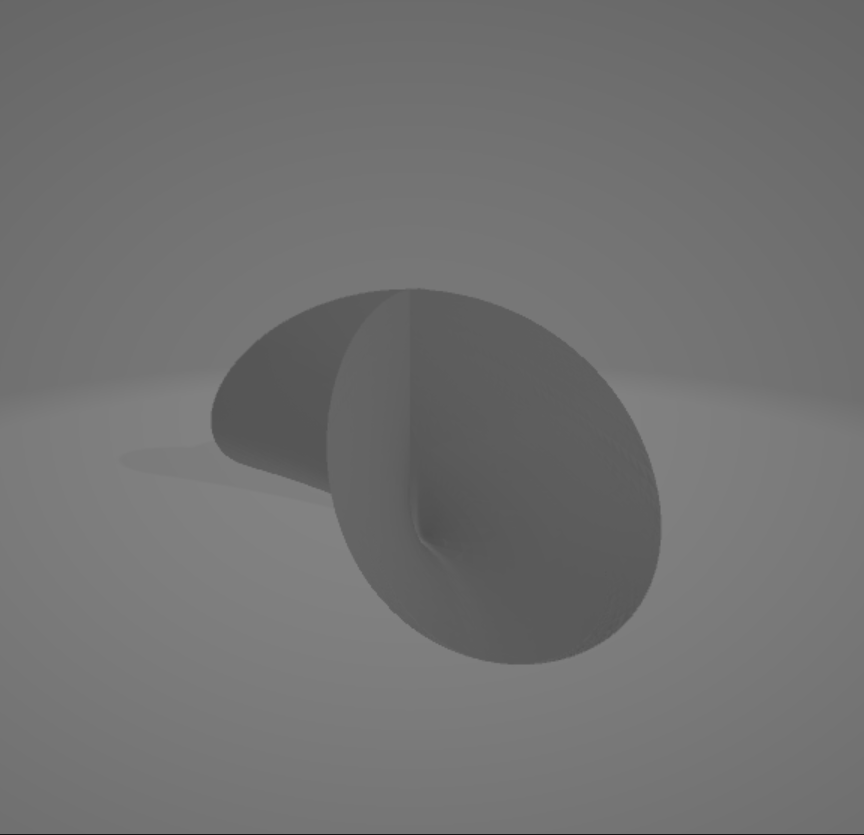
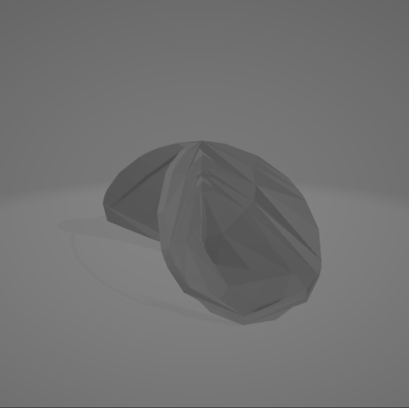

Introduction to Anaglypy with bertini_real
===========================================

The Anaglypy class in bertini_real allows user to render 3d anaglyph movies of algebraic surfaces using Blender/Python API.

Python Scripting
*****************

After decomposing a surface, you can either run the rendering process manually from  command-line or automate it through a shell script in anaglypy folder to export 3d stereoscopic movies. Please make sure you are using Python 3.7 (matches with the python version of Blender), have already installed Blender 2.8 and add it to the environmental path.

We are using a surface **"Crixxi"** in this example.

Running from command-line
**************************

Copy anaglypy.py into your surface folder. Then, run this command:

::

    $ blender -b P anaglypy.py

You can choose different options from the command-line menu for the video:

::

    Please choose:
    1) Raw
    2) Smooth
    3) Both
    Enter number: 

    reading from file BRdata0.pkl

    Please choose:
    1) Rotate Z
    2) Rotate XYZ
    3) Spin
    4) Multi Rotate
    Enter number: 

It will begin the rendering process:

::

    Created avi: render/crixxi_rotate_z_raw0000-0100_L.avi

    Fra:0 Mem:25.35M (0.00M, Peak 25.37M) | Time:00:00.00 | Mem:0.00M, Peak:0.00M | Scene, View Layer, left | Synchronizing object | crixxi

    Fra:0 Mem:25.71M (0.00M, Peak 25.71M) | Time:00:00.01 | Mem:0.00M, Peak:0.00M | Scene, View Layer, left | Initializing

    ....

Finally, you will the following output and you can find the video in a newly created folder, "render/".

::

    Export Anaglyph 3D crixxi_rotate_z_raw.avi successfully

Using Shell Scripting
**********************

First, create a folder (e.g., data/ ) containing all the surfaces that you have already decomposed by bertini_real.

Copy "anaglypy.py" and "anaglypy.sh" located in bertini_real's "anaglypy" python script foler to the "data/" folder you just created.

Remember to change permission of the shell script:

::

    $ chmod 755 anaglypy.sh

You will need 4 files to 

1. anaglypy.py 
2. anaglypy.sh
3. surfaces.txt
4. options.txt

Example: surfaces.txt
++++++++++++++++++++++
::

    crixxi
    daisy
    kreuz

Example: options.txt
+++++++++++++++++++++
::

    1
    3

You can display STL using any 3D STL viewer:

.. image:: tmesh_pictures/stl_raw_whitney.PNG
   :width: 300

To export the smooth version of STL, you can type:

::

	bertini_real.tmesh.stl_smooth(surface)

And you will see an output like this:

::

	bertini_real.tmesh.stl_smooth(surface)

	Generating smooth STL surface...
	Export stl_smooth_whitney.stl successfully

You can display STL using any 3D STL viewer:

To solidify the raw version of STL, you can type:

::

	bertini_real.tmesh.solidify_raw(surface)

And you will see an output like this:

::

	bertini_real.tmesh.solidify_raw(surface)

	Solidiying raw STL surface...
	Export solidify_raw_whitney.stl successfully

You can display STL using any 3D STL viewer:

To solidify the smooth version of STL, you can type:

::

	bertini_real.tmesh.solidify_smooth(surface)

And you will see an output like this:

::

	bertini_real.tmesh.solidify_smooth(surface)

	Solidiying smooth STL surface...
	Export solidify_smooth_whitney.stl successfully

You can display STL using any 3D STL viewer:

.. image:: tmesh_pictures/solidify_smooth_whitney.PNG
   :width: 300

:Author:
	Foong Min Wong

:Version: 1.0 2019/07/18
