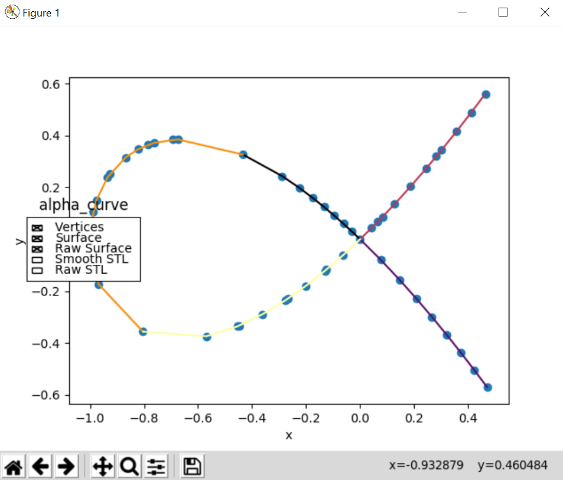
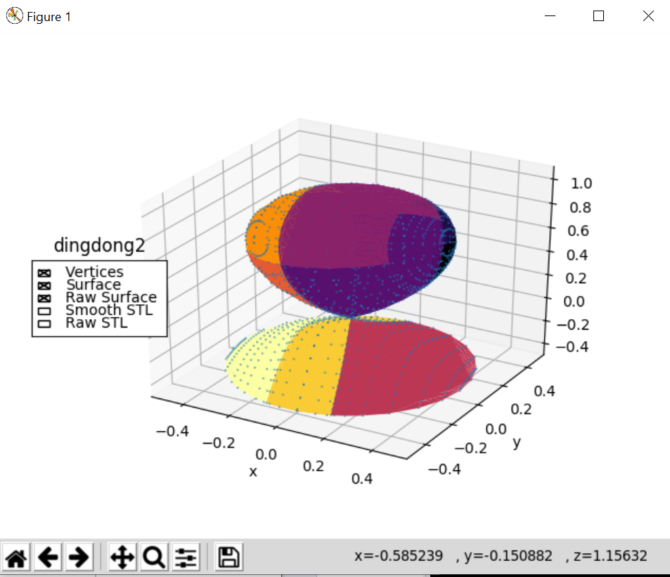

Introduction to Bertini_real
==========================================================

Bertini_real is a software for real algebraic sets. There are two options available to decompose and visualize algebraic curves & surfaces either using (1) Matlab or (2) Python. Since this documentation is for the Python libraray, we will focus on the Python visualization suite.  

Decomposition
**************
There are two types of child classes for Decomposition (parent class): (1) Curve and (2) Surface. Bertini_real will return either a `Curve` or `Surface` object based on the given algebraic equations.  Bertini_real cannot currently decompose components of algebraic varieties with dimension higher than two.

Gather and save decomposition
******************************

Use an interactive Python shell, such as iPython.  Start the instance of iPython from the terminal, when you are already in the folder containing the data you want to process.  For example, if you have a folder called `data/whitney/`, and in that folder is your bertini_real decomposition, then move to that folder and THEN launch iPython.

One you're in, you can run the following python codes to gather and save a decomposition of a curve/surface.

::

    import bertini_real

    bertini_real.data.gather_and_save()

To retrieve the most recent BRdata*.pkl, you can type:

::

    data = bertini_real.data.read_most_recent()

Plot curves and surfaces
*************************

There are two plotting modules (Plotter and `GlumpyPlotter <glumpy.html>`_) in Bertini_real Python visualization suite. In this example, we ar going to demonstrate how to plot it using Plotter object with matplotlib.

:: 

    bertini_real.plot.plot()

Here are some of the plotted curve/surface examples

**Alpha Curve** (Curve)

**Dingdong** (Surface)

Separate surfaces into pieces
******************************
We are working on the solidification feature for exporting singular algebraic surfaces STL in Bertini_real. We created a Piece object in Fall 2019 to separate surfaces into nonsingular pieces. In this example, we are going to separate surface **Dingdong** into nonsingular pieces.

:: 

    import bertini_real

    data = bertini_real.data.read_most_recent()

    pieces = data.separate_into_nonsingular_pieces()

We can print out the piece and it should return 2 pieces for **Dingdong**  with its corresponding lists of indices:

::

    print(pieces)

will output:

:: 

    [piece with indices:[0, 1, 2, 3, 5, 6]
    , piece with indices:[4, 7, 8]
    ]

We can access each piece by specifying their indices.  For example,

::

    print(pieces[0])

will output

:: 

    piece with indices:[0, 1, 2, 3, 5, 6]

There are a few properties and callable functions in a Piece object. You can run this command to generate a list of properties/functions for a Piece by running `dir(pieces[0])`, and you will get the following output:
::

    ['__doc__',
    '__init__',
    '__module__',
    '__repr__',
    '__str__',
    'indices',
    'is_compact',
    'point_singularities',
    'surface']

To access the indices of a Piece object, type `pieces[0].indices` and it'll output:

::

    [0, 1, 2, 3, 5, 6]

These are the indices of the faces in the Surface, of which the Piece is a part.

To check whether a Piece object is compact, type `pieces[0].is_compact()` and it'll output:

::

    True

To retrieve the list of point singularities from a Piece object, type `pieces[0].point_singularities()` and we get:

::

    [0]

There are a few modules used to plot surfaces and do 3d animations. To learn more, check out the following modules:

* `Anaglypy <anaglypy.html>`_ (A module that exports 3d anaglyph/non-anaglyph animations of algebraic surfaces)
* `GlumpyPlotter <glumpy.html>`_ (A module that plot curves/surfaces using Glumpy)

Additionally, the Surface module contains methods for exporting files for 3d printing

* `Surface <surface.html>`_ (The module has code to export obj files of surfaces for 3d printing using Trimesh)

:Author:
	Foong Min Wong, Silviana Amethyst

:Version: 1.2 2022/03/05

.. :Version: 1.1 2019/12/08
.. :Version: 1.0 2019/04/22
