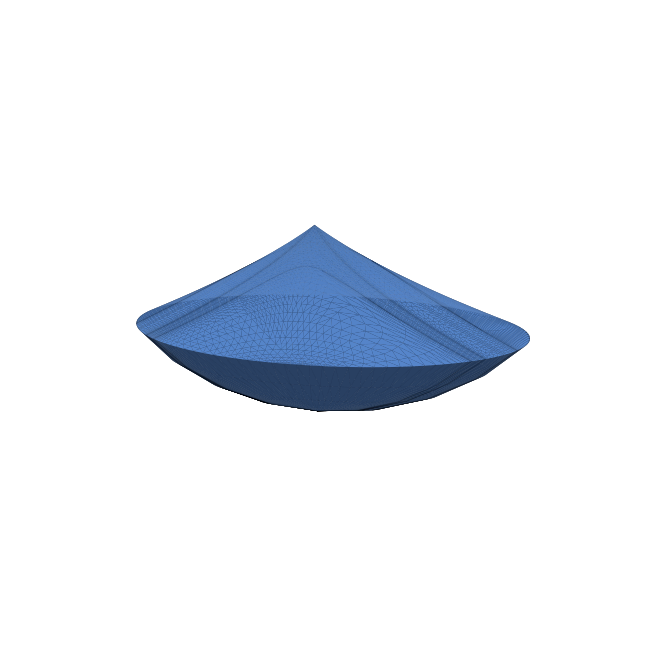
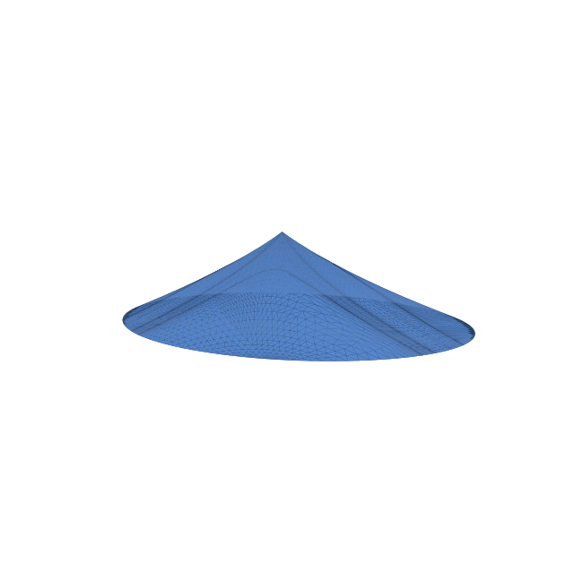
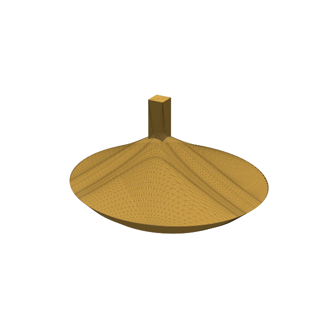
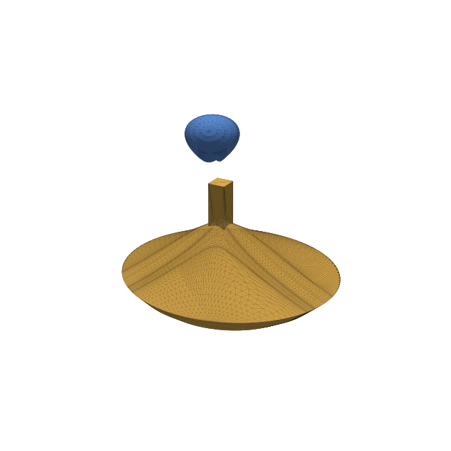
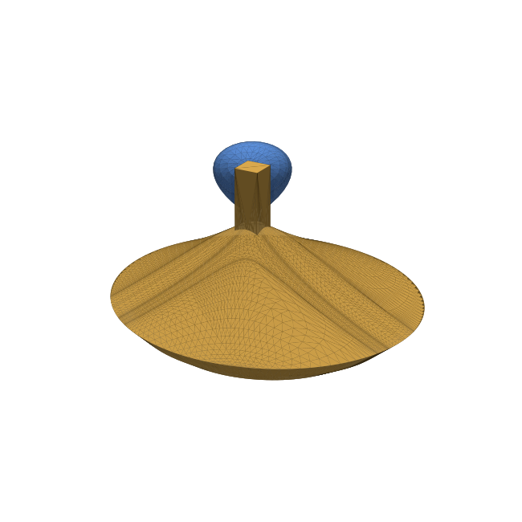

Capping pieces and joining them with connectors 🔩
===========================================================================

After ``bertini_real`` decomposes a surface, you can split it into its nonsingular
**pieces**, **cap** each piece where it was cut by the bounding sphere, and then do solid
modeling on the resulting closed meshes -- for example, drilling a hole in one piece and
adding a matching rod to its neighbor so they snap together.

Everything below is pure Python (using ``trimesh``); the same operations are available as
Grasshopper components (*Sphere Caps* / *Flat Caps*, *Close Piece*, *Boolean Piece*).

.. note::
   The mesh booleans use ``trimesh``'s exact ``manifold`` backend, so you need the
   ``manifold3d`` package installed (``pip install manifold3d``).  Watertight solids require
   a **sampled** decomposition.

We use **Ding Dong** here 🔔 -- two pieces (a wide cone and a small bell) that meet at a
single nodal singularity.

::

    import bertini_real
    surface = bertini_real.data.gather()          # run from the decomposition's folder
    pieces = surface.separate_into_nonsingular_pieces()

Spherical vs. flat caps
***********************************

Each piece's opening on the bounding sphere can be filled two ways.  ``as_closed_mesh()``
gives a **spherical** cap that continues the sphere; ``as_closed_mesh(flat=True)`` gives a
**flat** fan across the opening.  The sphere still shows where the piece was cut.

::

    domed = pieces[0].as_closed_mesh()            # spherical cap (default)
    flat  = pieces[0].as_closed_mesh(flat=True)   # flat cap

Spherical caps -- the underside bulges to follow the sphere:

Flat caps -- the same opening filled flat (interesting on blocky/raw decompositions):

Joining two pieces with a rod
***********************************

The two pieces meet at a singularity; ``singularity_connector_data()`` gives its location
and a direction (the tangent-cone axis) plus a per-piece parity that says which side gets
the **socket** (the hole) and which gets the **plug** (the rod).

::

    import numpy as np
    import trimesh
    from bertini_real.surface import mesh_boolean_fold, spread_pieces

    sing = surface.singularity_connector_data()
    location  = np.array(sing["locations"][0])
    direction = np.array(sing["directions"][0]); direction /= np.linalg.norm(direction)
    parity    = sing["parities"][0]
    socket = pieces[parity.index(-1)].as_closed_mesh()   # this one gets the hole
    plug   = pieces[parity.index(1)].as_closed_mesh()    # this one gets the rod

Build a square prism at the singularity, oriented along the direction.  Make the rod a
little smaller than the hole (``clearance``) so it can slide into the socket:

::

    def square_prism(width, length):
        box = trimesh.creation.box(extents=(width, width, length))   # centered, along Z
        box.apply_transform(trimesh.geometry.align_vectors([0, 0, 1.0], direction))
        box.apply_translation(location)
        return box

    width, length, clearance = 0.30, 1.40, 0.85
    hole = square_prism(width, length)
    rod  = square_prism(width * clearance, length)

Fold the booleans onto each piece -- subtract the hole (``-1``), union the rod (``+1``):

::

    socket_holed = mesh_boolean_fold(socket, [hole], [-1])
    plug_rodded  = mesh_boolean_fold(plug,   [rod],  [+1])

The plug, with a square rod grown out of it at the singularity:

Pulled apart (``spread_pieces``) you can see the rod on the cone and the receiving hole in
the underside of the bell:

::

    a, b = spread_pieces([socket_holed, plug_rodded], factor=0.8)

And seated together -- the rod joins the two pieces:

Export anything for printing with ``trimesh``'s ``mesh.export("piece.stl")``, or drive the
whole flow from the command line with ``python/scripts/close_pieces.py`` (it takes
``--flat``, ``--spread``, and ``--smooth/--raw``).

----

*The figures above were generated by* ``capping_and_joining_pictures/make_images.py``.
