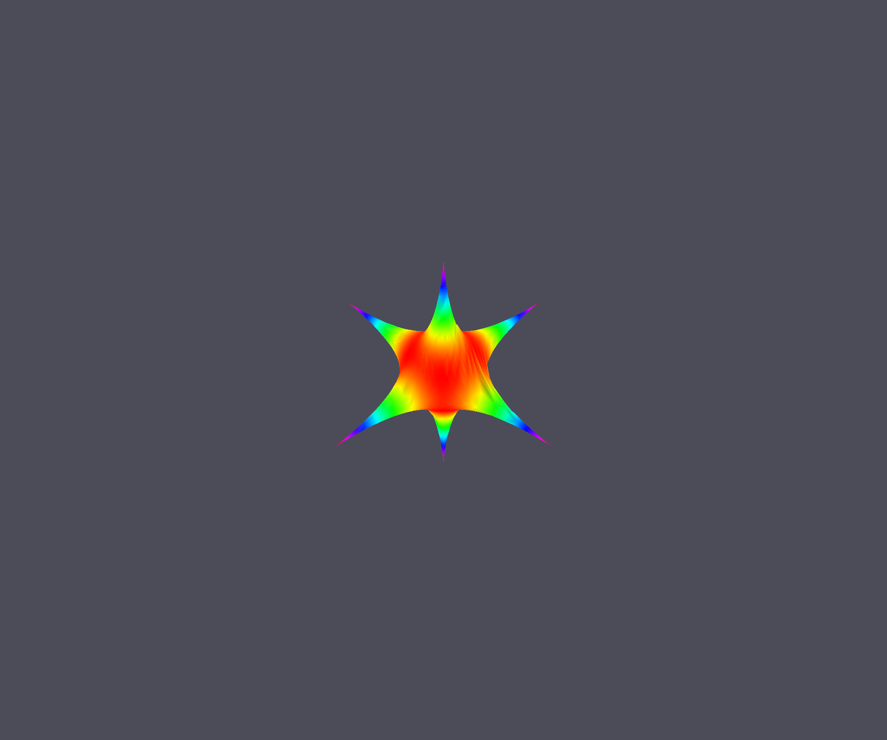
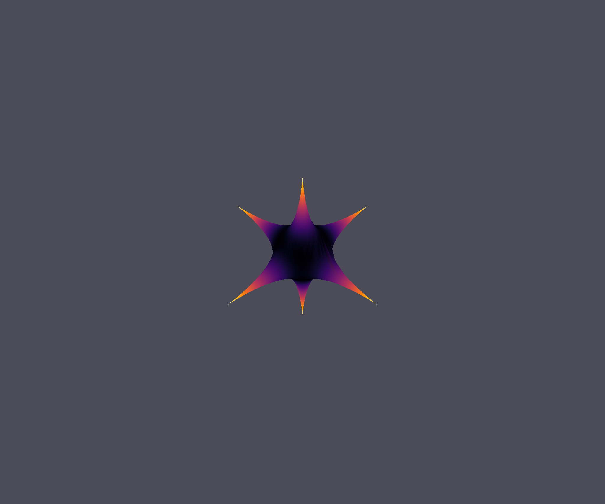

Introduction to Glumpy with bertini_real
=========================================

The Glumpyplotter class in bertini_real allows you to render the decompositions
computed by bertini_real.

Project Setup
**************

Before running the python code for this tutorial, you must ensure that you have
a decomposition either loaded in memory, or saved to disk. An example input file
for bertini can be found below. This surface is called **"Stern"**

::

    CONFIG

    randomseed: 1;

    endgamebdry: 0.01;

    tracktype: 1;
    securitylevel:0;

    sharpendigits: 50;

    condnumthreshold: 1e300;

    odepredictor: 5;

    %finaltol: 1e-16;

    numsamplepoints: 4;
    endgamenum: 2;

    maxstepsbeforenewton: 1;
    maxnewtonits: 2;

    END;

    INPUT
    variable_group x, y, z;
    function f;

    f  = 400*(x^2*y^2 + y^2*z^2 + x^2*z^2) + ( x^2 + y^2 + z^2 - 1)^3;

    END;

After saving this script as "input" you must run the following command:

::

    $ bertini; bertini_real; sampler

After this we will have a decomposition that can be rendered with the glumpyplotter
object.

Python Scripting
******************

At this point it I recommend using an interactive Python shell, although you may
also just create a .py file if you would like. I recommend using ipython as it is
far superior to the standard Python shell.

The easiest way to get ipython is with pip.

::

    $ pip install ipython

Once installed simply run the following command to be brought into an interactive shell.

::

    $ ipython

First we need to import bertini_real and save our data to a variable.

::

    import bertini_real

    surface = bertini_real.data.read_most_recent()

At this point, if all you want to do is render your surface you can simply type:

::

    bertini_real.glumpyplotter.plot_surface_samples(surface)

And your output will look like this:

With this window open you can zoom in by scrolling up or down. You can also
rotate the surface by clicking and dragging on it with the mouse.

As you can see, the default colormap is the 'hsv' colormap. This may not be ideal
for everybody so we can go ahead and change it. I am particularly fond of the 'inferno'
colormap. To do this we just need to specify a new colormap when calling the plot function.

::

    bertini_real.glumpyplotter.plot_surface_samples(surface, cmap='inferno')

And your output should look something like this:

Perfect, we've got cool new colors. Now, let's change how the colors are computed. To do
this we need to create our own color function. The default color function is:

::

    sqrt(x**2 + y**2 + z**2)

Creating a new color function is very simple. All that is required is that it takes
in an x, y, and z variable. Then it must return a value. This could be a constant value,
but it is recommended to compute a new value using the x, y, and z coordinates.
A simple function would look like:

::

    def custom_function(x, y, z):
        return x+y+z

The computation can be as simple or as complex as you like it. Once you have defined
a new function you just need to pass it as a parameter to the plot method.

::

    bertini_real.glumpyplotter.plot_surface_samples(surface, cmap='inferno', color_function=custom_function)

The result of this will be:

And that is the extent of the customization of the plot method.
Please create an issue on Github if you have any problems.

Complete script to copy and paste
*************************************

::

  #!/usr/local/bin/python3
  import bertini_real as br

  def function(x, y, z):
      return x + y + z

  fn = function

  br.glumpyplotter.plot_surface_samples()
  # br.glumpyplotter.plot_surface_samples(cmap='inferno')
  # br.glumpyplotter.plot_surface_samples(cmap='inferno', color_function=fn)

:Author:
    Dan Hessler

:Version: 1.0 of 2019/04/10
