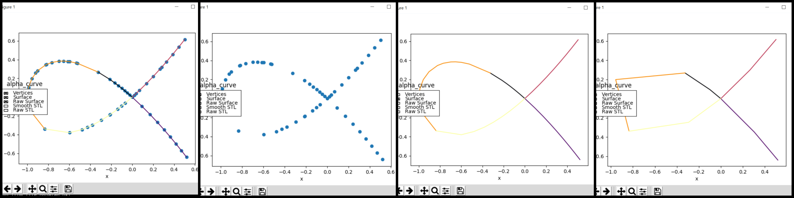
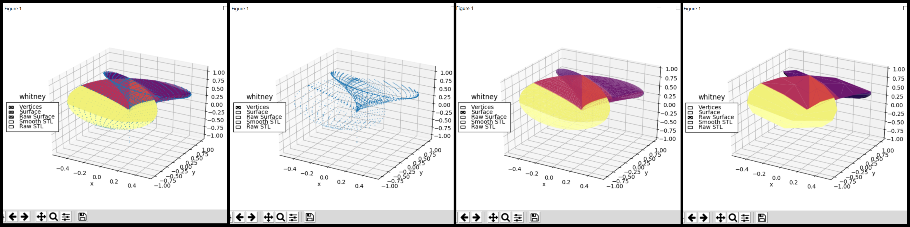
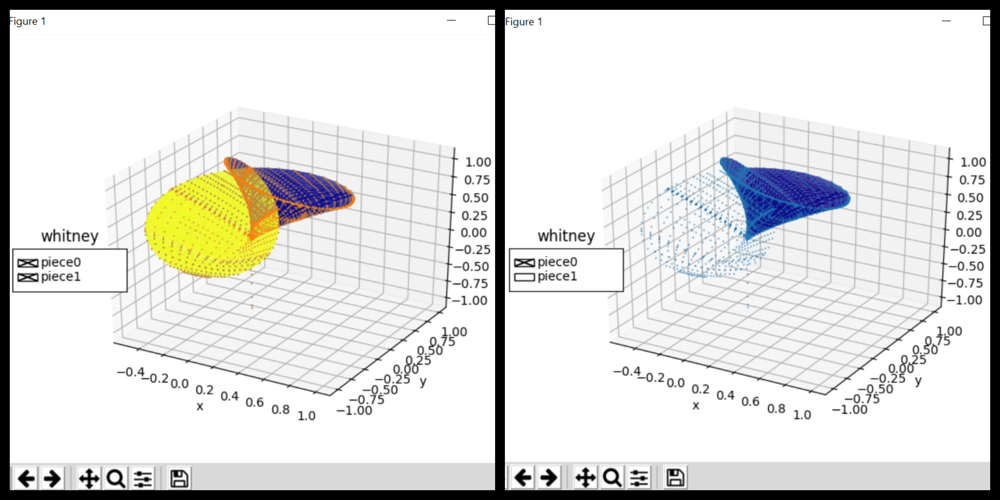

Plotting in Matplotlib
===========================================

The plot class in bertini_real uses matplotlib that allows you to render the decompositions
computed by bertini_real.

Matplotlib: Plotting a Curve/Surface
*************************************
After decomposing a surface, you can run the following python codes to plot curve/surface in the Python Shell. 
We are plotting a curve **Alpha Curve** and a surface  **"Whitney"** in this example ☂️ .

Example: Alpha Curve
*********************
::

    import bertini_real

    bertini_real.data.gather_and_save()

    curve = bertini_real.data.read_most_recent()

    bertini_real.plot.plot()

Example: Whitney
*****************
::

    import bertini_real

    bertini_real.data.gather_and_save()

    surface = bertini_real.data.read_most_recent()

    bertini_real.plot.plot()

Matplotlib: Plotting Pieces
****************************
Plotting pieces is only available for surface.

Example: Whitney
*****************
::

    import bertini_real

    surface = bertini_real.data.read_most_recent()

    pieces = surface.separate_into_nonsingular_pieces()

    bertini_real.surface.plot_pieces(pieces)

:Author:
	Foong Min Wong

:Version: 1.0 2020/03/01
