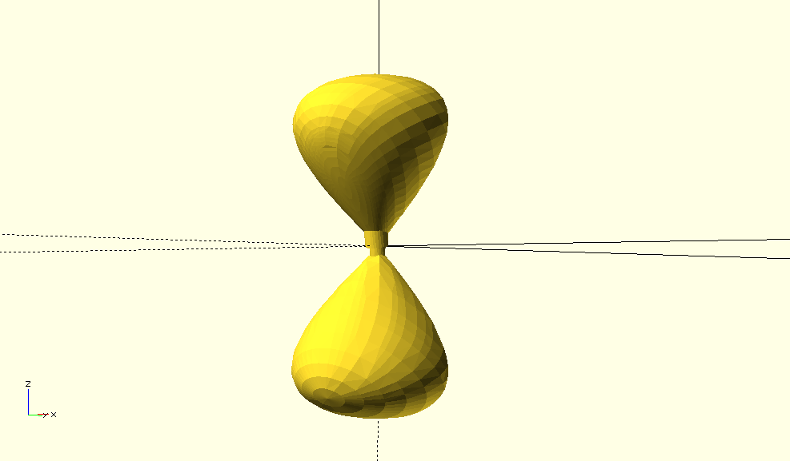

Snap together pieces via openSCAD🧩
===========================================================================

Attaching plug and sockets to pieces of nodally singular algebraic surfaces.
⚠️This implementation is no longer being persued, check out Snap together pieces in grasshopper⚠️

Exporting complete surfaces
*****************************

After decomposing a surface, you can run the following python codes to export and solidify OBJ in the Python Shell.
We are using a surface **"octdong"** in this example. First, you should navigate to your octodong directory via terminal. 
Then using an interactive python shell, execute the following lines.
If you have previously run *"gather()"* on the surface and have a **BRdata.pkl** file for the surface you can skip line 2

::

    import bertini_real as br

    br.data.gather() # do this once after decomposing and sampling the surface. If 

    surface = br.data.read_most_recent()

    pieces = surface.separate_into_nonsingular_pieces()

For each surface you will also need several scad files. We will take a closer look at each of these files later.
for now, copy these files into the current directory by running:

::

  surface.copy_all_scad_files_here()

Next we need to write to those files with the data of each piece of the surface. 
::

  surf.write_piece_data()

  for p in pieces:

    p.export_smooth()

The surf.write_piece_data function positions and orients the plug and socket and writes that data to an SCAD. This is accomplished by:

1. Finding each singularities that have two connecting pieces
2. for each of the connected pieces found. determine the centroid
3. the centroid and determines a vector to place the plug and socket along
4. write the following data to **br_surf_piece_data.scad**

    * piece indices
    * singularities on a piece
    * direction of the vector
    * singularity coordinates
    * and the parity of each piece(whether it gets a plug or socket)

Awesome! now we are ready to jump into openSCAD!

Viewing in openSCAD
*****************************

⚠️OpenSCAD is no longer being pursed in this project. It does not support the boolean difference required⚠️
opening the file **br_surf_complete.scad** in openSCAD will preview the surface!
Rendering will return the following

Now lets take a quick look at the other .scad files

* **plugs_and_sockets.scad** Holds the modules for plugs and sockets
* **plug_socket_params.scad** controls width, length, connection length for plugs and sockets, this is used for tweaking the model
* **br_modules.scad** Imports the smooth pieces to br_surf_complete
* **br_surf_piece_data.scad** python automatically writes this file
* **br_surf_complete.scad** brings the other 4 files together, this is the file you need to run

To do work 🚧
*****************************

  1. Determine center of mass
  2. Automatically compute size of plug and sockets
  3. Transfer construction from openSCAD to Blender

:Author:
	Caden Joergens

:Version: 1.1 2023/10/12
